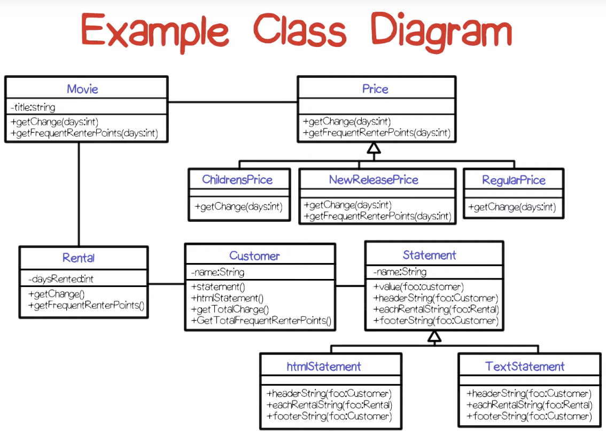
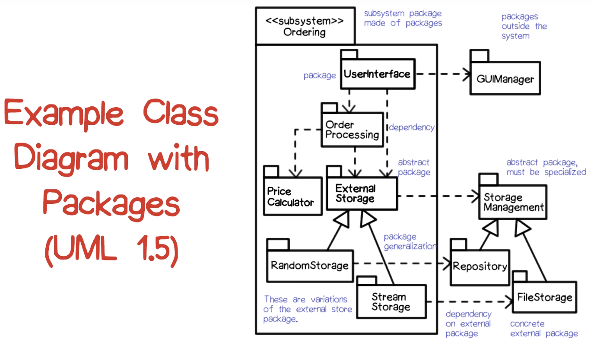
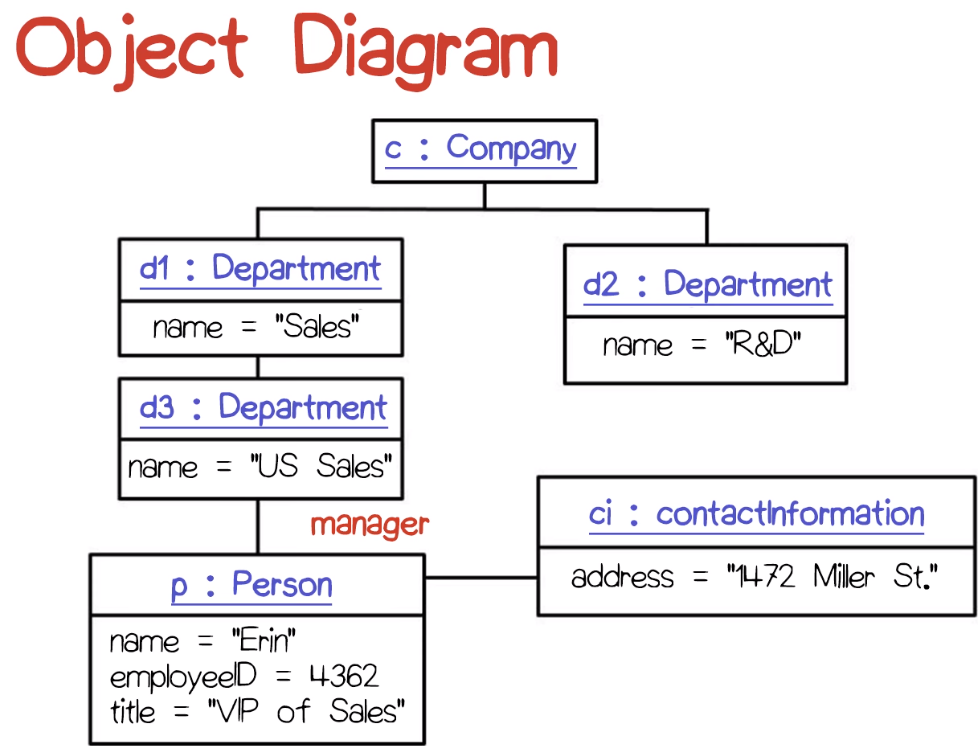
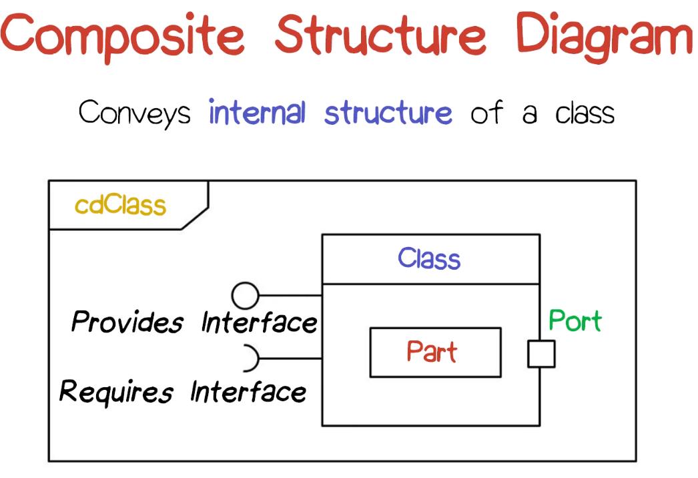
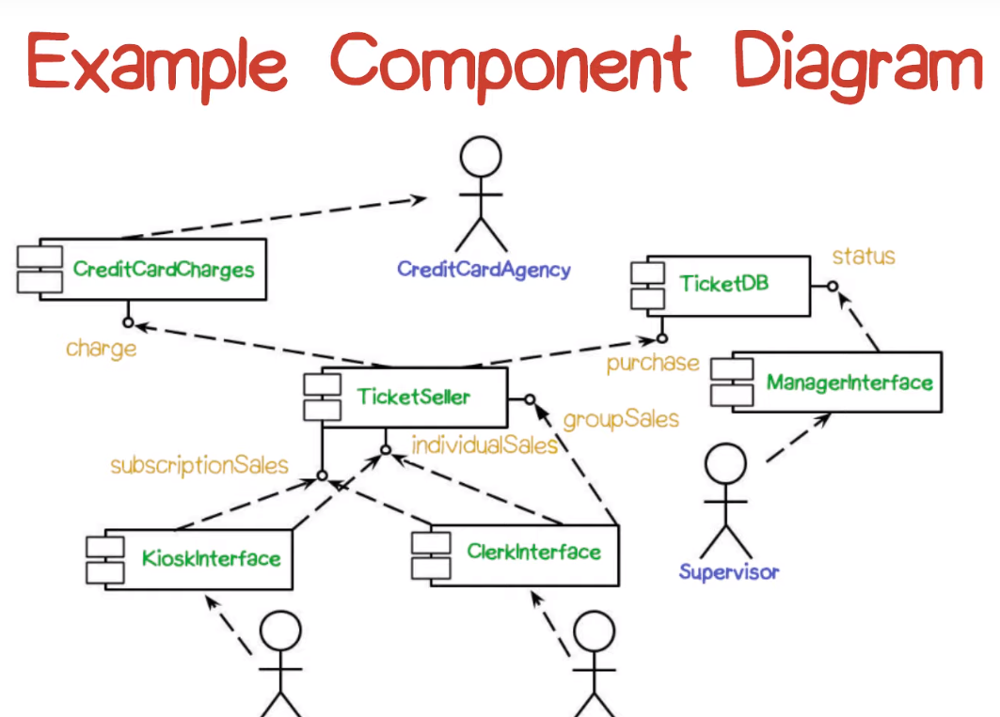
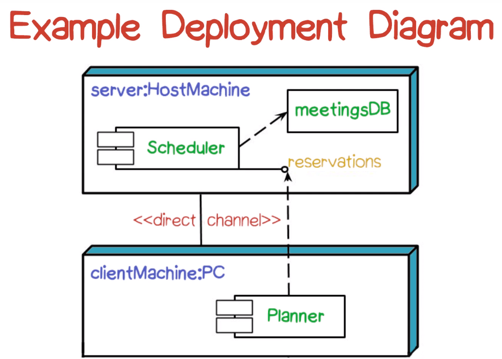
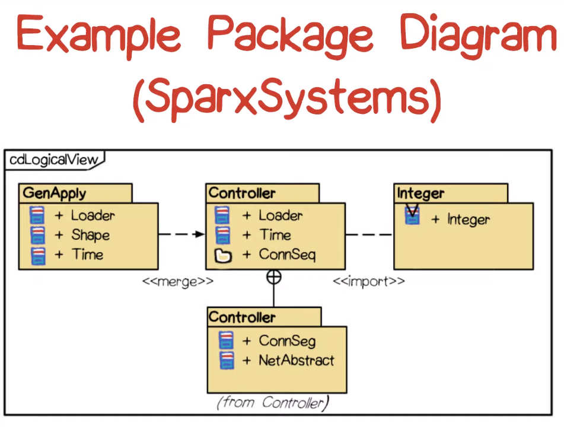
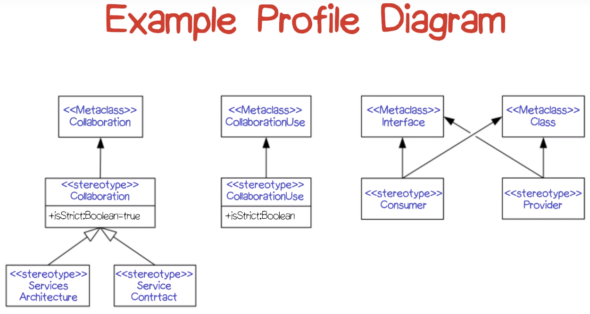

# Software Architecture Design

**Objectives**:

- Express the analysis and design of an application using the Unified Modeling Notation (UML)
- Specify functional semantics of an application using the Object Constraint Language (OCL)
- Specify and evaluate software architectures
- Select and use appropriate architectural styles
- Understand and apply object-oriented design techniques
- Select and use appropriate software design patterns 
- Understand and participate in a design review

**Software Design**:

The process of building a program while satisfying a problem's functional requirements and not violating its non-functional constraints.

- Architectural Design: 

  The process of identifying and assigning the responsibility for aspects of behavior to various modules or components of a software.

- Detail Design:

  The process of specifying the behavior of each of the system components that you've identified during architectural design.

**Design Notation**:

- Pseudo code; program design language (PDL)

  Keywords, free syntax of natural language, data declaration, subprogram definition and calling

- Structured programming

  Sequence, condition, repetition; chunking

- Flowcharts; call graphs

  Directed graphs: node is computational unit; arc is flow of control

- Decision tables

  Rules, conditions, actions

Three aspects for all approaches to software design:

- Design method: a particular way of viewing the problem

  - Structure design

  - Role-based design

- Design representation

- How that design is going to be validated

  - Independence of validators
  - Dependence on design method
  - On-going versus after-the-fact

**Design Documentation**

- Subcomponents:
  - Processes /activities
  - Data/data flows
- Control Flow
  - Control regime
- Performance
- Resources

**Leonardo Objects**:

- Stakeholders: views/interests; work procedures
- Issues bases: issues, alternatives, analyses, resolutions(commitments, decisions), rationale, impacts, conflicts
- Temporal relations: histories, schedules, transformations, versions(revisions, releases, variants)
- Constraints: internal, external(requirements, specifications)
- Aggregates: configurations, packages, components

**Conceptual Integrity**: 

- Coupling: to reduce (e.g. packages)
- Cohesion: to increase

**Abstraction Mechanisms**

- Declarative: what, not how

- Aggregation: container, not contents
- Generalization: class, not individuals
- Parameterization: binding details later
- Non-determinism: leaving choices unspecified

### Diagram

#### Structural diagram

**Class Model Diagram**

- most popular
- also called static models
- structural properties
- classes and relationships

UML class

| Name of class         |
| --------------------- |
| Attributes            |
| methods or operations |

UML relationships

- Dependency: X uses Y
- Associations: X affects Y
- Generalization: X is a kind of Y

**Object Diagram** (instances)

Conveys objects and links (static structure at a particular time)

| class name        |
| ----------------- |
| specific instance |

**Composite Structure Diagram**

Conveys internal structure of a class

**Component diagram**

Convey architecture (organization of physical software components)

**Deployment Diagram**

Communications between the physical components

**Package Diagram**

logical groupings and dependencies

**Profile Diagram**

(High level) extensions to the UML meta model

To convey system architecture:

- Class diagram
- Component diagram
- Deployment diagram
- Package diagram

#### Behavior diagram

Focus on specific uses

