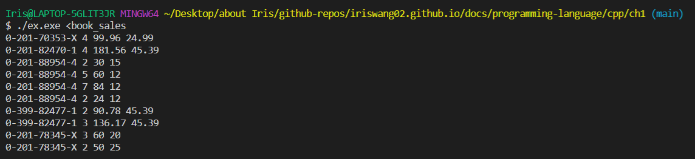
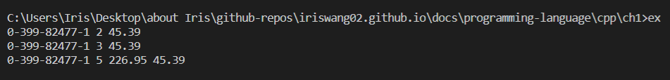
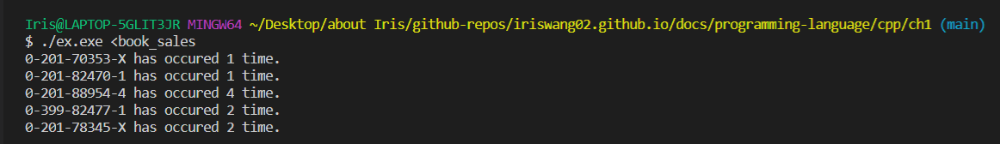
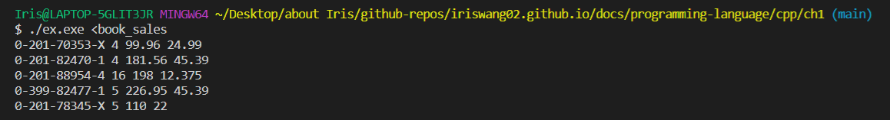

# Chapter 1 Getting Started

### Exercise 1.1

*Q: Review the documentation for your compiler and determine what file naming convention it uses. Compile and run the main program from page 2.*

- [GNU Complier](http://labor-liber.org/en/gnu-linux/development/index.php?diapo=extensions)

- [MSVC](https://docs.microsoft.com/en-us/cpp/build/reference/file-types-created-for-visual-cpp-projects?redirectedfrom=MSDN&view=msvc-160)


### Exercise 1.2

*Q: Change the program to return `-1`. A return value of `-1` is often treated as an indicator that the program failed. Recompile and rerun your program to see how your system treats a failure indicator from `main`.*


### Exercise 1.3

*Q: Write a program to print Hello, World on the standard output.*

```c++
#include <iostream>

int main() {
    std::cout << "Hello, World" << std::endl;
    return 0;
}
```


### Exercise 1.4

*Q: Our program used the addition operator, +, to add two numbers. Write a program that uses the multiplication operator, \*, to print the product instead.*

```c++
#include <iostream>

int main() {
    std::cout << "Enter two numbers:" << std::endl;
    int v1 = 0, v2 = 0;
    std::cin >> v1 >> v2;
    std::cout << "The product of " << v1 << " and " << v2
              << " is " << v1 * v2 << std::endl;
    return 0;
}
```


### Exercise 1.5

*Q: We wrote the output in one large statement. Rewrite the program to use a separate statement to print each operand.*

```c++
#include <iostream>

int main() {
    std::cout << "Enter two numbers:" << std::endl;
    int v1 = 0, v2 = 0;
    std::cin >> v1 >> v2;
    std::cout << "The product of ";
    std::cout << v1 ;
    std::cout << " and " ;
    std::cout << v2;
    std::cout << " is ";
    std::cout << v1 * v2;
    std::cout << std::endl;
    return 0;
}
```


### Exercise 1.6

*Q: Explain whether the following program fragment is legal.*

It's illegal. `[Error] expected an expression`

*If the program is not legal, how would you fix it:* 

remove semicolons


### Exercise 1.7

*Q: Compile a program that has incorrectly nested comments.*

```c++
/*
* comment pairs /* */ cannot nest.
* ''cannot nest'' is considered source code,
* as is the rest of the program
*/
int main()
{
  return 0;
}
```

`[Error] identifier "cannot" is undefined`

One comment pair cannot appear inside another.


### Exercise 1.8

*Q: Indicate which, if any, of the following output statements are legal:*

```c++
std::cout << "/*";
std::cout << "*/";
std::cout << /* "*/" */;
std::cout << /* "*/" /* "/*" */;
```

The first two statements are legal.

The third statement: `[Error] missing closing quote`

The fourth statement is legal.

*Q: Correct any errors you encounter:*

```c++
std::cout << /* "*/" */";
```


### Exercise 1.9

*Q: Write a program that uses a `while` to sum the numbers from 50 to 100.*

```c++
#include <iostream>

int main() {
    int sum = 0, val = 50;
    while (val <= 100) {
        sum += val;
        ++val;
    }
    std::cout << "Sum of 50 to 100 inclusive is: " << sum << std::endl;
    return 0;
}
```


### Exercise 1.10

*Q: Use the decrement operator to write a `while` that prints the numbers from 10 down to 0.*

```c++
#include <iostream>

int main() {
    int val = 10;
    while (val >= 0) {
        std::cout<<val<<std::endl;
        --val;
    }
    return 0;
}
```


### Exercise 1.11

*Q: Write a program that prompts the user for two integers. Print each number in the range specified by those two integers.*

```c++
#include <iostream>

int main() {
    
    std::cout<<"Enter two numbers:"<<std::endl;
    int n1, n2, idx;
    std::cin>>n1>>n2;
    while (n1 <= n2) { // assuming n1<=n2
        std::cout<<n1<<std::endl;
        ++n1;
    }
    return 0;
}
```


### Exercise 1.12

*Q: What does the following for loop do? What is the final value of sum?*

```c++
int sum = 0;
for (int i = -100; i <= 100; ++i)
    sum += i;
```

the loop sums the number from -100 to 100. the final value of sum is zero.


### Exercise 1.13

*Q: Rewrite the exercises from § 1.4.1 (p. 13) using for loops.*

Ex1.9:

```c++
#include <iostream>

int main() {
    int sum = 0, val = 50;
    for (int val=50; val<=100; ++val) {
        sum += val;
    }
    std::cout << "Sum of 50 to 100 inclusive is: " << sum << std::endl;
    return 0;
}
```


Ex1.10:

```c++
#include <iostream>

int main() {
    for (int val=10; val>=0; --val) {
        std::cout<<val<<std::endl;
    }
    return 0;
}
```


Ex1.11:

```c++
#include <iostream>

int main() {
    
    std::cout<<"Enter two numbers:"<<std::endl;
    int n1, n2, idx;
    std::cin>>n1>>n2;
    for (int i=n1; i<=n2; ++i) { // assuming n1<=n2
        std::cout<<i<<std::endl;
    }
    return 0;
}
```


### Exercise 1.14

*Q: Compare and contrast the loops that used a for with those using a while. Are there advantages or disadvantages to using either form?*

> The main difference between the `for`'s and the `while`'s is a matter of pragmatics: we usually use `for` when there is a known number of iterations, and use `while` constructs when the number of iterations in not known in advance.

Also, for loop offers more flexibility with `break` and `continue` statements.


### Exercise 1.15

*Q: Write programs that contain the common errors discussed in the box on page 16. Familiarize yourself with the messages the compiler generates.*


### Exercise 1.16

*Q: Write your own version of a program that prints the sum of a set of integers read from `cin`.*

```c++
#include <iostream>

int main() {
    
    int sum = 0;
    for (int val; std::cin>>val; sum += val)
    std::cout<<sum<<std::endl;
    return 0;
}
```


### Exercise 1.17

*Q: What happens in the program presented in this section if the input values are all equal? What if there are no duplicated values?*

If all equal, only one line is printed out. If there are no duplicated values, the number of lines printed is the same as the number of values.


### Exercise 1.18

*Q: Compile and run the program from this section giving it only equal values as input. Run it again giving it values in which no number is repeated.*


### Exercise 1.19

*Q: Revise the program you wrote for the exercises in § 1.4.1 (p. 13) that printed a range of numbers so that it handles input in which the first number is smaller than the second.*

```c++
#include <iostream>

int main() {
    
    std::cout<<"Enter two numbers:"<<std::endl;
    int n1, n2, idx;
    std::cin>>n1>>n2;
    
    // ==============================
    if (n2<n1) {
    	int temp = n1;
    	n1 = n2;
    	n2 = temp;
    }
    // ==============================
    
    while (n1 <= n2) { // assuming n1<=n2
        std::cout<<n1<<std::endl;
        ++n1;
    }
    return 0;
}
```


### Exercise 1.20

*Q: http://www.informit.com/title/032174113 contains a copy of `Sales_item.h` in the Chapter 1 code directory. Copy that file to your working directory. Use it to write a program that reads a set of book sales transactions, writing each transaction to the standard output.*

```c++
#include "Sales_item.h"

int main() {
    Sales_item book;
    while (std::cin >> book) {
        std::cout << book << std::endl;
    }
    return 0;
}
```




### Exercise 1.21

*Q: Write a program that reads two `Sales_item` objects that have the same ISBN and produces their sum.*

```c++
#include "Sales_item.h"

int main() {
    Sales_item item1, item2;
    std::cin >> item1 >> item2;
    if (item1.isbn() == item2.isbn()) {
        std::cout << item1 + item2 << std::endl;
        return 0;
    }
    else {
        std::cerr << "Data must refer to same ISBN." << std::endl;
        return -1;
    }
}
```




### Exercise 1.22

*Q: Write a program that reads several transactions for the same ISBN. Write the sum of all the transactions that were read.*

```c++
#include "Sales_item.h"

int main()
{
    Sales_item item, all_items;
    while (std::cin >> item) {
        all_items = all_items + item;
    }
    std::cout << all_items << std::endl;
    return 0;
}
```


### Exercise 1.23

*Q: Write a program that reads several transactions and counts how many transactions occur for each ISBN.*

```c++
#include "Sales_item.h"

int main()
{
    Sales_item item;
    if (std::cin >> item) {
        int cnt = 1;
        std::string currISBN = item.isbn();
        while (std::cin >> item) {
            if (item.isbn() == currISBN)
                cnt += 1;
            else {
                std::cout << currISBN << " has occured " << cnt << " time. "  << std::endl;
                currISBN = item.isbn();
                cnt = 1;
            }
        }
        std::cout << currISBN << " has occured " << cnt << " time. "  << std::endl;
    }
    else {
        std::cerr << "No data?!" << std::endl;
        return -1;
    }

    return 0;
}
```




### Exercise 1.24

*Q: Test the previous program by giving multiple transactions representing multiple ISBNs. The records for each ISBN should be grouped together.*

```c++
#include "Sales_item.h"

int main()
{
    Sales_item item, total;
    if (std::cin >> total) {
        while (std::cin >> item) {
            if (item.isbn() == total.isbn()) {
                total = total + item;
            } else {
                std::cout << total << std::endl;
                total = item;
            }
        }
        std::cout << total << std::endl;
    }
    else {
        std::cerr << "No data?!" << std::endl;
        return -1;
    }
    return 0;
}
```




### Exercise 1.25

*Q: Using the `Sales_item.h` header from the Web site, compile and execute the bookstore program presented in this section.*


