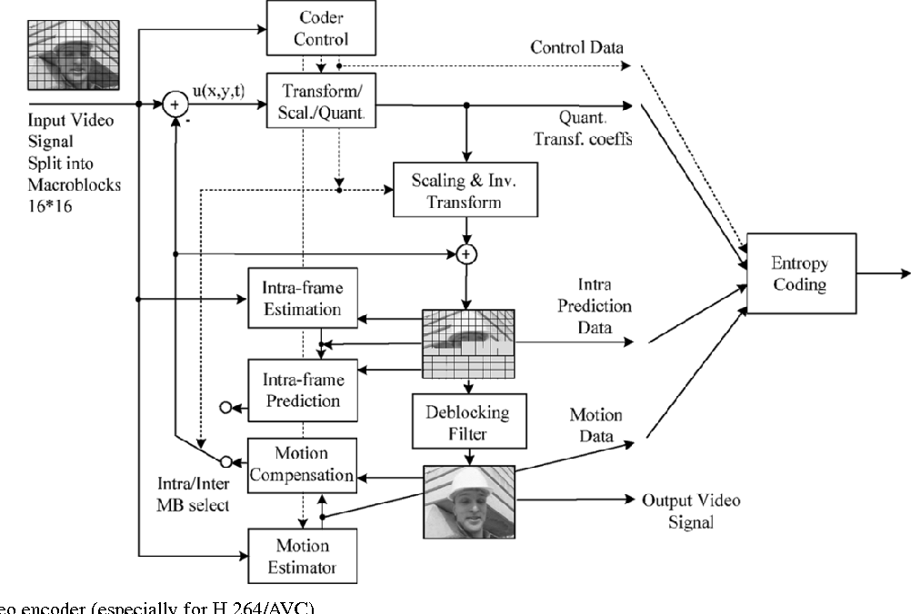

# H.264/AVC

### Strategy summary:

Each picture is split into blocks (MB 16*16). The first picture of a video sequence is typically coded in Intra mode. For all remaining pictures of a sequence or between random access points, typically inter-picture coding modes are used for most blocks. The encoding process for Inter prediction consists of choosing motion data comprising the selected reference picture and MV to be applied for all samples of each block. The motion and mode decision data, which are transmitted as side information, are used by the encoder and decoder to generate identical Inter prediction signals using MC.

The residual of the Intra or Inter prediction, which is the difference between the original block and its prediction, is transformed by a frequency transform. The transform coefficients are then scaled, quantized, entropy code, and transmitted together with the prediction side information.

The encoder duplicates the decoder processing so that both will generate identical predictions for subsequent data. Therefore, the quantized transform coefficients are constructed by inverse scaling and are then inverse transformed to duplicate the decoded prediction residual. The residual is then added to the prediction, and the result of that addition may then be fed into a deblocking filter to smooth out block-edge discontinuities induced by the block-wise processing. The final picture is then stored for the prediction of subsequent encoded pictures. 

(In general, the order of the encoding or decoding processing of pictures often differs from the order in which they arrive from the source, necessitating a distinction between the decoding order and the output order for a decoder.)

The design and operation of an encoder involves the optimization of many decisions to achieve the best possible tradeoff between rate and distortion given the constraints on delay and complexity. 

*reference: GARY J. SULLIVAN, "Video Compression - From Concepts to the H.264/AVC Standard", PROCEEDINGS OF THE IEEE, VOL. 93, NO. 1, JANUARY 2005.*

