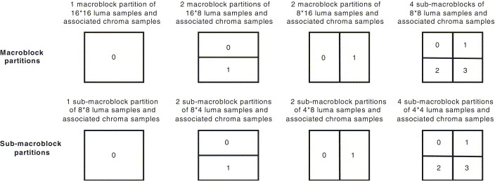

# Inter-Picture Prediction

### P Slices:

P macroblocks can be partitioned into smaller regions for MCP with luma block sizes of 16x16, 16x8, 8x16, and 8x8 samples. 

When 8x8 macroblock partitioning is chosen, an additional syntax element is transmitted for each 8x8 partition, which specifies whether the 8x8 partition is further partitioned into smaller regions of 8x4, 4x8, or 4x4 luma samples and corresponding chroma samples. 

(MCP for smaller regions than 8x8 uses the same reference index for predicting all blocks in an 8x8 region)

The prediction signal for each predictive-coded MxN luma block is obtained by MC, which is specified by <u>a translational MC and a picture reference index</u>. The syntax allows MVs to point over picture boundaries.

<u>The accuracy of MC is in units of one-quarter</u> of the horizontal or vertical distance between luma samples. If the MV points to an integer-sample position, the prediction signal consists of the corresponding samples of the reference picture; otherwise, the corresponding sample is obtained using *interpolation*. 

- The prediction values at **half-sample positions** are obtained by applying a one-dimensional six-tap FIR filter. 
- Prediction values at **quarter-sample positions** are generated by averaging two samples at integer- and half-sample positions.

The MV values are differentially coded using either median or directional prediction from neighboring blocks. No MV value prediction takes place across slice boundaries.

P_Skip mode: neither a quantized prediction error signal nor an MV with a reference index is sent. The reconstructed signal is obtained using only a prediction signal like that of a P_16x16 macroblock that references the picture in list0. The useful effect of this P_Skip coding type is that large areas with no change or constant motion can be represented with very few bits.

### B Slices:

B slices use a similar macroblock partitioning as P slices.

For each 16x16, 16x8, 8x16, 8x8 partition, the prediction method can be chosen separately.

### Weighted prediction in P and B slices:

A encoder can specify scaling weights and offsets to be used for each prediction signal in the P and B macroblocks of a slice. The weighting and offset values can be inferred from temporally related relationships or can be specified within the same slice for performing MCP using the same particular reference picture.

