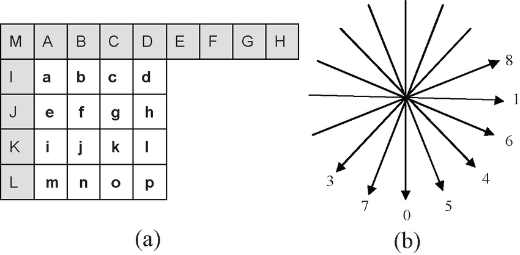

# Intra-Picture Prediction

3 slice-coding types of intra coding:

- Intra_4x4 (parts with significant detail)
- Intra_16x16 (very smooth areas)
- I_PCM

Intra prediction in H.264/AVC is always conducted in the spatial domain, by referring to neighboring samples of previously decoded blocks that are to the left and/or above the block to be predicted.

For example, in **Intra_4x4 mode**, the 16 samples of the 4x4 luma block, marked a-p, are predicted using position-specific linear combinations of previously decoded samples, marked A-M, from adjacent blocks.

The encoder can select <u>either DC"prediction</u> (where an average value is used to predict the entire block) <u>or one of eight directional prediction types</u>. The directional modes are designed to model object edges at various angles.

In **Intra_16x16 mode**, the 16x16 luma block is predicted in one of four prediction modes: <u>vertical, horizontal, DC, and plane</u>.

Plane prediction uses position-specific linear combinations that effectively model the predicted block as a plane with an approximate fit for the horizontal and vertical variation along the block edges.

For the **I_PCM** type, no prediction is performed and the raw values of the samples are simply sent without compression.