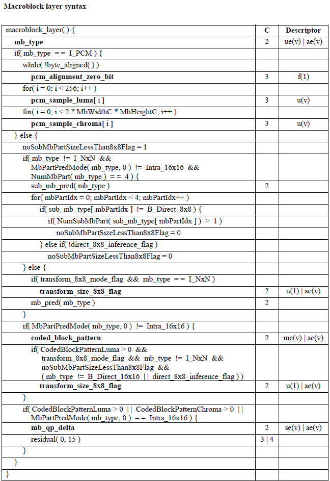
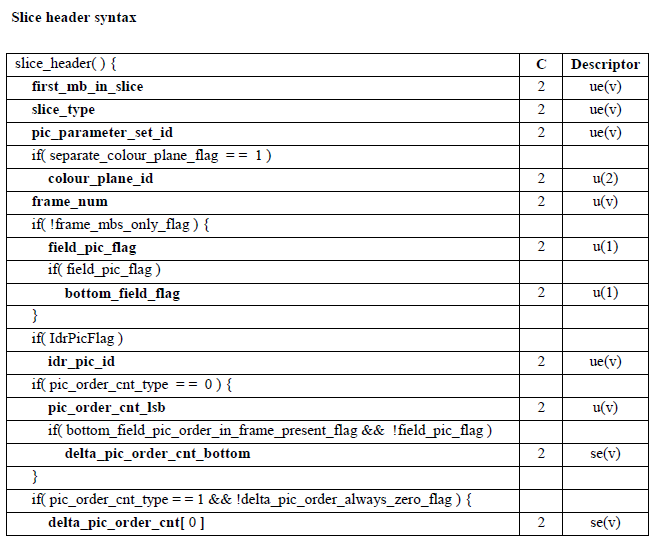
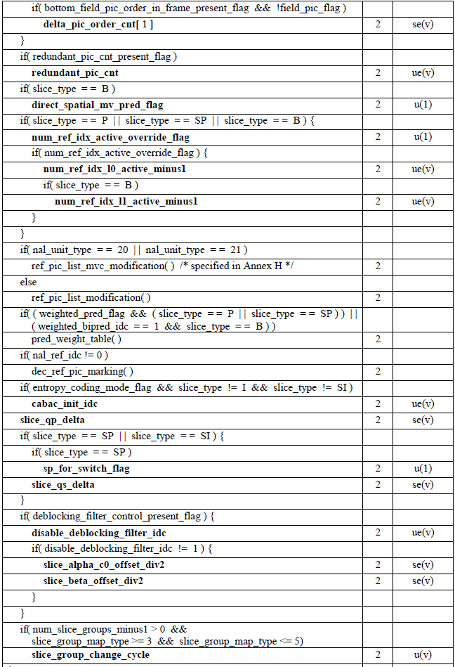
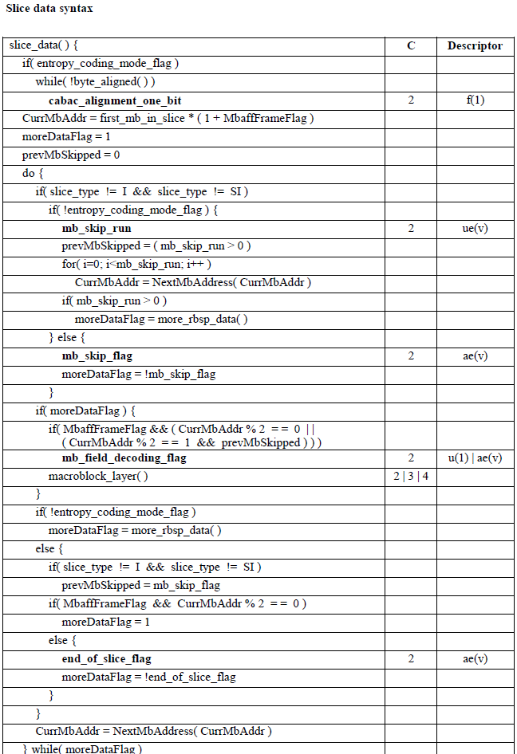

# Partition

### Macroblocks:

Each picture is partitioned into fixed size macroblocks that each contain a rectangular picture area of 16x16 samples for the luma component and the corresponding 8x8 samples for each of the two chroma components.

The luma and chroma samples of a macroblock are predicted - either spatially or temporally.

### Slices:

The macroblocks of the picture are organized into slices, which represent regions of a given picture that can be decoded independently.

Each slice is a sequence of macroblocks that is processed in the order of a raster scan. A picture may contain one or more slices. 

Each slice is self-contained, given the active sequence and PPS, its syntax elements and be parsed from the bitstream and the values of the samples in the area of the picture that the slice represents can basically be decoded without use of data from other slices of the picture.

However, for completely exact decoding, some information from other slices may be needed in order to apply the deblocking filter across slice boundaries. Slices can be used for:

- error resilience, as the partitioning of the picture allows spatial concealment within the picture and as the start of each slice provides a resynchronization point at which the decoding process can be reinitialized;
- creating well-segmented payloads for packets that fit the maximum transfer unit size of a network.
- parallel processing, as each slice can be encoded and decoded independently of the other slices of the picture.

Loss robustness can be enhanced by 

- separating more important data from less important data and reflecting data dependencies and importance by using separate NAL units packets for data of different categories. **[data partitioning]**
- sending duplicative coded representations of some or all parts of the picture. **[redundant slices]**

Slice types: I/P/B, SP/SI (switching)

