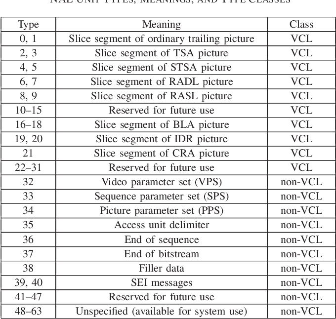
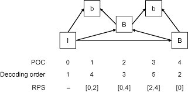

# High-Level Syntax

The high-level syntax of HEVC contains numerous elements that have been inherited from the NAL of h.264.

### Random access and bitstream splicing features

The new design supports special features to enable random access and bitstream splicing. **(In h.264, a bitstream must always start with an IDR access unit.)**

An IDR access unit contains an independently coded picture.

The new *clean random access* (CRA) picture syntax specifies the use of an independently coded picture at the location of a *random access point* (RAP). 

Some pictures that follow a CRA picture in decoding order and precede it in display order may contain inter-picture prediction references to pictures that are not available at the decoder. These non-decodable are identified as *random access skipped leading* (RASL) pictures.

The other type of picture that can follow a RAP picture in decoding order and precede it in display order is the *random access decodable leading* (RADL) picture, which cannot contain references to any pictures that precede the RAP picture in decoding order. 

RASL and RADL pictures are collectively referred to as *leading pictures* (LPs). 

Pictures that follow a RAP picture in both decoding order and display order, which are known as trailing pictures, cannot contain references to LPs for inter-picture prediction.

The location of splice points from different original coded bitstreams can be indicated by broken link access (BLA) pictures. 

### Temporal Sub-layering Support

HEVC specifies a temporal identifier in the NAL unit header, which indicates a level in a hierarchical temporal prediction structure. **(similar to the temporal scalability feature in h.264 scalable video coding (SVC) extension.)**

The location of a point in the bitstream at which sublayer switching is possible to begin decoding some higher temporal layers can be indicated by the presence of *temporal sublayer access* (TSA) pictures and *stepwise TSA* (STSA) pictures.

TSA: a position that is possible to switch from decoding a lower temporal sublayer to decoding any higher temporal sublayer

STSA: a position that is possible to switch from decoding a lower temporal sublayer to decoding only one particular higher temporal sublayer. 

### Additional Parameter Sets

The VPS has been added as metadata to describe the overall characteristics of coded video sequences, including the dependences between temporal sublayers.

The primary purpose of this is to enable the compatible extensibility of the standard in terms of signaling at the system layer.

### Reference Picture Sets and Reference Picture Lists

For multiple-reference picture management, reference picture set (RPS) is used to be present in the decoded picture buffer (DPB) for the decoding of the remainder of the pictures in the bitstream.

To identify these pictures, a list of picture order count (POC) identifiers is transmitted in each slice header.

There are two lists (list0, list1) that are constructed as lists of pictures in the DPB. **(same in h.264)**

The high-level syntax for identifying the RPS and establishing the reference picture lists for inter-picture prediction is **more robust to data losses than in h.264 design**, and is more amenable to such operations as random access and trick mode operation.

A key aspect of this improvement is that **the syntax is more explicit**, rather than depending on inferences from the stored internal state of the decoding process as it decodes the bitstream picture by picture. Moreover, the associated syntax for these aspects of the design is **simpler than it had been for h.264.**

