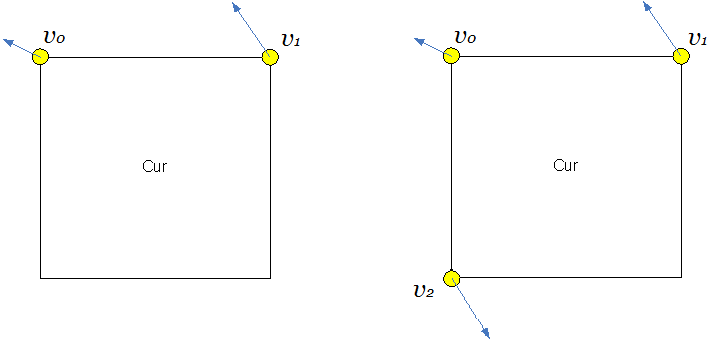
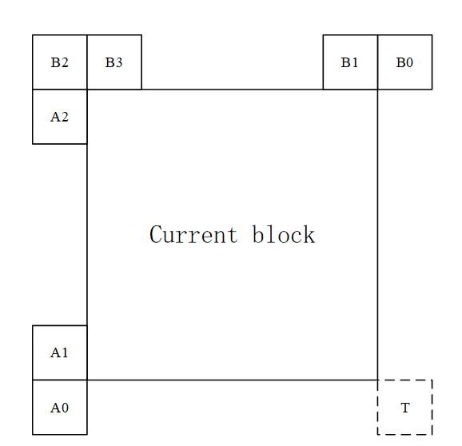

# Affine Motion Compensated Prediction


HEVC: translation motion model

VTM: many kinds of motion, e.g. zoom in/out, rotation, perspective motions and the other irregular motions.


**Affine model:**



​						(a)  4 parameter affine model 										 (b)  6 parameter affine model


There are also two affine motion inter prediction modes: affine merge mode and affine AMVP mode.


### AF_MERGE mode


**Condition:**

AF_MERGE mode can be applied for CUs with both width and height larger than or equal to 8.

```
if ( bestCS->area.lumaSize().width < 8 || bestCS->area.lumaSize().height < 8 )
{
    return;
}
```


```c++
static const int AFFINE_MRG_MAX_NUM_CANDS =                         5; ///< AFFINE MERGE
```


#### **GET affine merge candidate:**

The following three types of CPVM candidate are used to form the affine merge candidate list:

1. <u>Inherited</u> affine merge candidates that extrapolated from the CPMVs of the neighbor CUs
2. <u>Constructed</u> affine merge candidates CPMVPs that are derived using the translational MVs of the neighbor CUs
3. <u>Zero MVs</u>


```c++
PU::getAffineMergeCand()
```


**MV field Initialization**

```c++
for ( int i = 0; i < maxNumAffineMergeCand; i++ )
{
    for ( int mvNum = 0; mvNum < 3; mvNum++ )
    {
      affMrgCtx.mvFieldNeighbours[(i << 1) + 0][mvNum].setMvField( Mv(), -1 );
      affMrgCtx.mvFieldNeighbours[(i << 1) + 1][mvNum].setMvField( Mv(), -1 );
    }
    affMrgCtx.interDirNeighbours[i] = 0;
    affMrgCtx.affineType[i] = AFFINEMODEL_4PARAM;
    affMrgCtx.mergeType[i] = MRG_TYPE_DEFAULT_N;
    affMrgCtx.GBiIdx[i] = GBI_DEFAULT;
}
```


**Inherit**

There are maximum two inherited affine candidates, which are derived from affine motion model of the neighboring blocks, one from left neighboring CUs and one from above neighboring CUs. For the left predictor, the scan order is A0->A1, and for the above predictor, the scan order is B0->B1->B2.  

```c++
///> Start: inherited affine candidates
const PredictionUnit* npu[5];
int numAffNeighLeft = getAvailableAffineNeighboursForLeftPredictor( pu, npu );
int numAffNeigh = getAvailableAffineNeighboursForAbovePredictor( pu, npu, numAffNeighLeft );

for ( int idx = 0; idx < numAffNeigh; idx++ )
{
	// derive Mv from Neigh affine PU
    Mv cMv[2][3];
    const PredictionUnit* puNeigh = npu[idx];
    pu.cu->affineType = puNeigh->cu->affineType;
    if ( puNeigh->interDir != 2 )
    {
		xInheritedAffineMv( pu, puNeigh, REF_PIC_LIST_0, cMv[0] );
    }
    if ( slice.isInterB() )
    {
        if ( puNeigh->interDir != 1 )
        {
            xInheritedAffineMv( pu, puNeigh, REF_PIC_LIST_1, cMv[1] );
        }
    }
    for ( int mvNum = 0; mvNum < 3; mvNum++ )
    {
		affMrgCtx.mvFieldNeighbours[(affMrgCtx.numValidMergeCand << 1) + 0]						[mvNum].setMvField( cMv[0][mvNum], puNeigh->refIdx[0] );
        affMrgCtx.mvFieldNeighbours[(affMrgCtx.numValidMergeCand << 1) + 1]						[mvNum].setMvField( cMv[1][mvNum], puNeigh->refIdx[1] );
	}
    affMrgCtx.interDirNeighbours[affMrgCtx.numValidMergeCand] = puNeigh->interDir;
	affMrgCtx.affineType[affMrgCtx.numValidMergeCand] = (EAffineModel)(puNeigh->cu-			>affineType);
    affMrgCtx.GBiIdx[affMrgCtx.numValidMergeCand] = puNeigh->cu->GBiIdx;

    if ( affMrgCtx.numValidMergeCand == mrgCandIdx )
    {
        return;
    }
    // early termination
    affMrgCtx.numValidMergeCand++;
    if ( affMrgCtx.numValidMergeCand == maxNumAffineMergeCand )
    {
        return;
    }
}
```


**Construct**

Constructed affine candidate means the candidate is constructed by combining the neighbor translational motion information of each control point. The motion information for the control points is derived from the specified spatial neighbors and temporal neighbor shown below. 




CPMVk (k=1, 2, 3, 4) represents the k-th control point. 

For CPMV1, the B2->B3->A2 blocks are checked and the MV of the first available block is used. 

For CPMV2, the B1->B0 blocks are checked and for CPMV3, the A1->A0 blocks are checked. 

For TMVP is used as CPMV4 if it’s available.

```c++
MotionInfo mi[4];

// control point: LT B2->B3->A2
const Position posLT[3] = { pu.Y().topLeft().offset( -1, -1 ), pu.Y().topLeft().offset( 0, -1 ), pu.Y().topLeft().offset( -1, 0 ) };
for ( int i = 0; i < 3; i++ )
{
    const Position pos = posLT[i];
    const PredictionUnit* puNeigh = cs.getPURestricted( pos, pu, pu.chType );

    if ( puNeigh && CU::isInter( *puNeigh->cu ))
    {
        isAvailable[0] = true;
        mi[0] = puNeigh->getMotionInfo( pos );
        neighGbi[0] = puNeigh->cu->GBiIdx;
        break;
    }
}

// control point: RT B1->B0
	...
    
// control point: LB A1->A0
    ...

// control point: RB
if ( slice.getEnableTMVPFlag() )
{
    //>> MTK colocated-RightBottom
    // offset the pos to be sure to "point" to the same position the uiAbsPartIdx would've pointed to
    Position posRB = pu.Y().bottomRight().offset( -3, -3 );
    const PreCalcValues& pcv = *cs.pcv;
    Position posC0;
    bool C0Avail = false;
    
    if ( ((posRB.x + pcv.minCUWidth) < pcv.lumaWidth) && ((posRB.y + pcv.minCUHeight) < pcv.lumaHeight) )
    {
        int posYInCtu = posRB.y & pcv.maxCUHeightMask;
        if (posYInCtu + 4 < pcv.maxCUHeight)
        {
            posC0 = posRB.offset(4, 4);
            C0Avail = true;
        }
    }
    Mv        cColMv;
    int       refIdx = 0;
    bool      bExistMV = C0Avail && getColocatedMVP( pu, REF_PIC_LIST_0, posC0, cColMv, refIdx );
    if ( bExistMV )
    {
        mi[3].mv[0] = cColMv;
        mi[3].refIdx[0] = refIdx;
        mi[3].interDir = 1;
        isAvailable[3] = true;
    }
    if ( slice.isInterB() )
    {
        bExistMV = C0Avail && getColocatedMVP( pu, REF_PIC_LIST_1, posC0, cColMv, refIdx );
        if ( bExistMV )
        {
            mi[3].mv[1] = cColMv;
            mi[3].refIdx[1] = refIdx;
            mi[3].interDir |= 2;
            isAvailable[3] = true;
        }
    }
}
```


After MVs of four control points are attained, affine merge candidates are constructed based on those motion information. The following combinations of control point MVs are used to construct in order:

{CPMV1, CPMV2, CPMV3}, {CPMV1, CPMV2, CPMV4}, {CPMV1, CPMV3, CPMV4},

{CPMV2, CPMV3, CPMV4}, { CPMV1, CPMV2}, { CPMV1, CPMV3}

```c++
//-------------------  insert model  -------------------//
int order[6] = { 0, 1, 2, 3, 4, 5 };
int modelNum = 6;
int model[6][4] = {
	{ 0, 1, 2 },          // 0:  LT, RT, LB
    { 0, 1, 3 },          // 1:  LT, RT, RB
    { 0, 2, 3 },          // 2:  LT, LB, RB
    { 1, 2, 3 },          // 3:  RT, LB, RB
    { 0, 1 },             // 4:  LT, RT
    { 0, 2 },             // 5:  LT, LB
};

int verNum[6] = { 3, 3, 3, 3, 2, 2 };
int startIdx = pu.cs->sps->getUseAffineType() ? 0 : 4;
for ( int idx = startIdx; idx < modelNum; idx++ )
{
    int modelIdx = order[idx];
    getAffineControlPointCand(pu, mi, isAvailable, model[modelIdx], ((modelIdx == 3) ? 		neighGbi[1] : neighGbi[0]), modelIdx, verNum[modelIdx], affMrgCtx);
    
    if ( affMrgCtx.numValidMergeCand != 0 && affMrgCtx.numValidMergeCand - 1 == mrgCandIdx )
    {
        return;
    }
    // early termination
    if ( affMrgCtx.numValidMergeCand == maxNumAffineMergeCand )
    {
        return;
    }
}
```


**Zero MVs**

```c++
int cnt = affMrgCtx.numValidMergeCand;
while ( cnt < maxNumAffineMergeCand )
{
    for ( int mvNum = 0; mvNum < 3; mvNum++ )
    {
        affMrgCtx.mvFieldNeighbours[(cnt << 1) + 0][mvNum].setMvField( Mv( 0, 0 ), 0 );
    }
    affMrgCtx.interDirNeighbours[cnt] = 1;
    
    if ( slice.isInterB() )
    {
        for ( int mvNum = 0; mvNum < 3; mvNum++ )
        {
            affMrgCtx.mvFieldNeighbours[(cnt << 1) + 1][mvNum].setMvField( Mv( 0, 0 ), 0 );
        }
        affMrgCtx.interDirNeighbours[cnt] = 3;
    }
    affMrgCtx.affineType[cnt] = AFFINEMODEL_4PARAM;
    
    if ( cnt == mrgCandIdx )
    {
        return;
    }
    cnt++;
    affMrgCtx.numValidMergeCand++;
}
```


### Affine AMVP mode


**Condition**:

Affine AMVP mode can be applied for CUs with both width and height larger than or equal to 16.


The affine AVMP candidate list size is 2 and it is generated by using the following four types of CPVM candidate in order:

1. <u>Inherited</u> affine AMVP candidates that extrapolated from the CPMVs of the neighbour CUs
2. <u>Constructed</u> affine AMVP candidates CPMVPs that are derived using the translational MVs of the neighbour CUs.
3. <u>Translational</u> MVs from neighboring CUs
4. <u>Zero MVs</u>

```c++
for ( uint32_t uiRefListIdx = 0; uiRefListIdx < 2; uiRefListIdx++ )
{
    RefPicList eRefList = RefPicList( uiRefListIdx );
    if ( pu.cs->slice->getNumRefIdx( eRefList ) > 0 && ( pu.interDir & ( 1 << uiRefListIdx ) ) )
    {
        AffineAMVPInfo affineAMVPInfo;
        PU::fillAffineMvpCand( pu, eRefList, pu.refIdx[eRefList], affineAMVPInfo );
        const unsigned mvp_idx = pu.mvpIdx[eRefList];
        pu.mvpNum[eRefList] = affineAMVPInfo.numCand;

        //    Mv mv[3];
        CHECK( pu.refIdx[eRefList] < 0, "Unexpected negative refIdx." );
        if (!cu.cs->pcv->isEncoder)
        {
            pu.mvdAffi[eRefList][0].changeAffinePrecAmvr2Internal(pu.cu->imv);
            pu.mvdAffi[eRefList][1].changeAffinePrecAmvr2Internal(pu.cu->imv);
            if (cu.affineType == AFFINEMODEL_6PARAM)
            {
                pu.mvdAffi[eRefList][2].changeAffinePrecAmvr2Internal(pu.cu->imv);
            }
        }
        Mv mvLT = affineAMVPInfo.mvCandLT[mvp_idx] + pu.mvdAffi[eRefList][0];
        Mv mvRT = affineAMVPInfo.mvCandRT[mvp_idx] + pu.mvdAffi[eRefList][1];
        mvRT += pu.mvdAffi[eRefList][0];
        
        Mv mvLB;
        if ( cu.affineType == AFFINEMODEL_6PARAM )
        {
            mvLB = affineAMVPInfo.mvCandLB[mvp_idx] + pu.mvdAffi[eRefList][2];
            mvLB += pu.mvdAffi[eRefList][0];
        }
        PU::setAllAffineMv(pu, mvLT, mvRT, mvLB, eRefList, true);
    }
}
```


```c++
PU::fillAffineMvpCand()
```

```c++
struct AffineAMVPInfo
{
    Mv       mvCandLT[ AMVP_MAX_NUM_CANDS_MEM ];  ///< array of affine motion vector predictor candidates for left-top corner
    Mv       mvCandRT[ AMVP_MAX_NUM_CANDS_MEM ];  ///< array of affine motion vector predictor candidates for right-top corner
    Mv       mvCandLB[ AMVP_MAX_NUM_CANDS_MEM ];  ///< array of affine motion vector predictor candidates for left-bottom corner
    unsigned numCand;                       ///< number of motion vector predictor candidates
};
```


**Inherit**

The checking order of inherited affine AMVP candidates is same to the checking order of inherited affine merge candidates. The only difference is that, for AVMP candidate, only the affine CU that has the same reference picture as in current block is considered.

```c++
// insert inherited affine candidates
Mv outputAffineMv[3];
Position posLT = pu.Y().topLeft();
Position posRT = pu.Y().topRight();
Position posLB = pu.Y().bottomLeft();

// check left neighbor
if ( !addAffineMVPCandUnscaled( pu, eRefPicList, refIdx, posLB, MD_BELOW_LEFT, affiAMVPInfo ) )
{
    addAffineMVPCandUnscaled( pu, eRefPicList, refIdx, posLB, MD_LEFT, affiAMVPInfo );
}

// check above neighbor
if ( !addAffineMVPCandUnscaled( pu, eRefPicList, refIdx, posRT, MD_ABOVE_RIGHT, affiAMVPInfo ) )
{
    if ( !addAffineMVPCandUnscaled( pu, eRefPicList, refIdx, posRT, MD_ABOVE, affiAMVPInfo ) )
    {
        addAffineMVPCandUnscaled( pu, eRefPicList, refIdx, posLT, MD_ABOVE_LEFT, affiAMVPInfo );
    }
}
```


**Construct**

Constructed AMVP candidate is derived from the specified spatial neighbors. The same checking order is used as done in affine merge candidate construction. In addition, reference picture index of the neighboring block is also checked.

```c++
// insert constructed affine candidates
int cornerMVPattern = 0;

//-------------------  V0 (START) -------------------//
AMVPInfo amvpInfo0;
amvpInfo0.numCand = 0;

// A->C: Above Left, Above, Left
addMVPCandUnscaled( pu, eRefPicList, refIdx, posLT, MD_ABOVE_LEFT, amvpInfo0 );
if ( amvpInfo0.numCand < 1 )
{
    addMVPCandUnscaled( pu, eRefPicList, refIdx, posLT, MD_ABOVE, amvpInfo0 );
}
if ( amvpInfo0.numCand < 1 )
{
    addMVPCandUnscaled( pu, eRefPicList, refIdx, posLT, MD_LEFT, amvpInfo0 );
}
cornerMVPattern = cornerMVPattern | amvpInfo0.numCand;

//-------------------  V1 (START) -------------------//
AMVPInfo amvpInfo1;
amvpInfo1.numCand = 0;

// D->E: Above, Above Right
addMVPCandUnscaled( pu, eRefPicList, refIdx, posRT, MD_ABOVE, amvpInfo1 );
if ( amvpInfo1.numCand < 1 )
{
    addMVPCandUnscaled( pu, eRefPicList, refIdx, posRT, MD_ABOVE_RIGHT, amvpInfo1 );
}
cornerMVPattern = cornerMVPattern | (amvpInfo1.numCand << 1);

//-------------------  V2 (START) -------------------//
AMVPInfo amvpInfo2;
amvpInfo2.numCand = 0;

// F->G: Left, Below Left
addMVPCandUnscaled( pu, eRefPicList, refIdx, posLB, MD_LEFT, amvpInfo2 );
if ( amvpInfo2.numCand < 1 )
{
    addMVPCandUnscaled( pu, eRefPicList, refIdx, posLB, MD_BELOW_LEFT, amvpInfo2 );
}
cornerMVPattern = cornerMVPattern | (amvpInfo2.numCand << 2);

outputAffineMv[0] = amvpInfo0.mvCand[0];
outputAffineMv[1] = amvpInfo1.mvCand[0];
outputAffineMv[2] = amvpInfo2.mvCand[0];
```


**Zero MVs**

Zero MVs are used to fill the affine AMVP list if it is still not full.

```c++
if ( affiAMVPInfo.numCand < 2 )
{
    // add zero MV
    for ( int i = affiAMVPInfo.numCand; i < AMVP_MAX_NUM_CANDS; i++ )
    {
        affiAMVPInfo.mvCandLT[affiAMVPInfo.numCand].setZero();
        affiAMVPInfo.mvCandRT[affiAMVPInfo.numCand].setZero();
        affiAMVPInfo.mvCandLB[affiAMVPInfo.numCand].setZero();
        affiAMVPInfo.numCand++;
    }
}
```

