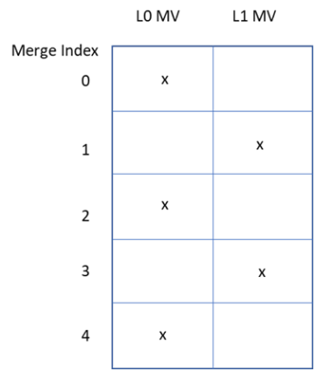

# Triangle Prediction Mode


The triangle partition mode is only applied to CUs that are 8x8 or larger. The triangle partition mode is signalled using a CU-level flag as one kind of merge mode, with other merge modes including the regular merge mode, the MMVD mode, the CIIP mode and the subblock merge mode.

```c++
cu.triangle = true;
```


When this mode is used, a CU is split evenly into two triangle-shaped partitions, using either the diagonal split or the anti-diagonal split.


**Initialization**

```c++
//  TRIANGLE_MAX_NUM_CANDS = 60, 6 mv choices for P1 * 5 mv choices for P2 * two partitions(diagonal/anti-diagonal split) = 60
uint8_t		numTriangleCandidate   = TRIANGLE_MAX_NUM_CANDS;
//  TRIANGLE_MAX_NUM_SATD_CANDS = 3
uint8_t		triangleNumMrgSATDCand = TRIANGLE_MAX_NUM_SATD_CANDS;
//  TRIANGLE_MAX_NUM_UNI_CANDS = 6
PelUnitBuf		triangleBuffer[TRIANGLE_MAX_NUM_UNI_CANDS];
PelUnitBuf		triangleWeightedBuffer[TRIANGLE_MAX_NUM_CANDS];

static_vector<uint8_t, TRIANGLE_MAX_NUM_CANDS>		triangleRdModeList;
static_vector<double,  TRIANGLE_MAX_NUM_CANDS>		trianglecandCostList;

//  6*5*2=60
uint8_t		numTriangleCandComb = slice.getMaxNumTriangleCand() * (slice.getMaxNumTriangleCand() - 1) * 2;
```


#### **GET affine merge candidate:**

```
PU::getTriangleMergeCandidates()
```


**Merge list candidates initialization**

```c++
for (int32_t i = 0; i < TRIANGLE_MAX_NUM_UNI_CANDS; i++)
{
	// Default weighting index representing for w=0.5  (bi-directional)
    triangleMrgCtx.GBiIdx[i] = GBI_DEFAULT;
    // Prediction direction of neighbor block. 1: forward, 2: backward, 3: bi-directional
    triangleMrgCtx.interDirNeighbours[i] = 0;
    triangleMrgCtx.mrgTypeNeighbours[i] = MRG_TYPE_DEFAULT_N;
    triangleMrgCtx.mvFieldNeighbours[(i << 1)].refIdx = NOT_VALID; // forward
    triangleMrgCtx.mvFieldNeighbours[(i << 1) + 1].refIdx = NOT_VALID; // backward
    triangleMrgCtx.mvFieldNeighbours[(i << 1)].mv = Mv(); // forward
    triangleMrgCtx.mvFieldNeighbours[(i << 1) + 1].mv = Mv(); // backward
    triangleMrgCtx.useAltHpelIf[i] = false;
  }
```


**Uni-prediction candidate list construction**

First construct a normal merge candidate list (6)

```
PU::getInterMergeCandidates()
```


Traverse each candidate in the merge candidate list, then select suitable candidates based on the table shown below and fill triangle uni-directional prediction list.

```c++
for (int32_t i = 0; i < maxNumMergeCand; i++)
{
    int parity = i & 1; //
    if (tmpMergeCtx.interDirNeighbours[i] & (0x01 + parity))
    {
        // even - forward - L0, odd - backward - L1
        triangleMrgCtx.interDirNeighbours[triangleMrgCtx.numValidMergeCand] = 1 + parity;
        triangleMrgCtx.mrgTypeNeighbours[triangleMrgCtx.numValidMergeCand] = MRG_TYPE_DEFAULT_N;
        triangleMrgCtx.mvFieldNeighbours[(triangleMrgCtx.numValidMergeCand << 1) + !parity].mv = Mv(0, 0);
        triangleMrgCtx.mvFieldNeighbours[(triangleMrgCtx.numValidMergeCand << 1) + parity].mv = tmpMergeCtx.mvFieldNeighbours[(i << 1) + parity].mv;
        triangleMrgCtx.mvFieldNeighbours[(triangleMrgCtx.numValidMergeCand << 1) + !parity].refIdx = -1;
        triangleMrgCtx.mvFieldNeighbours[(triangleMrgCtx.numValidMergeCand << 1) + parity].refIdx = tmpMergeCtx.mvFieldNeighbours[(i << 1) + parity].refIdx;
        triangleMrgCtx.numValidMergeCand++;
        if (triangleMrgCtx.numValidMergeCand == TRIANGLE_MAX_NUM_UNI_CANDS)
        {
            return;
        }
        continue;
    }
    
    // If for normal merge candidates, the even ones only have backward mv, just fill triangle uni-directional prediction list with backward mv.
    // If for normal merge candidates, the odd ones only have forward mv, just fill triangle uni-directional prediction list with forward mv.
    if (tmpMergeCtx.interDirNeighbours[i] & (0x02 - parity))
    {
        triangleMrgCtx.interDirNeighbours[triangleMrgCtx.numValidMergeCand] = 2 - parity;
        ...
    }
}
```





#### **Candidates selection**

Each partition has one motion vector and one reference index. The uni-prediction motion constraint is applied to ensure that same as the conventional bi-prediction, only two motion compensated prediction are needed for each CU.

If triangle partition mode is used for the current CU, then a flag indicating the direction of the triangle partition (diagonal or anti-diagonal), and two merge indices (one for each partition) are further signalled.  

```c++
// 60 combinations SAD-cost (1st round selection) -> 3 candidates
for( uint8_t mergeCand = 0; mergeCand < numTriangleCandidate; mergeCand++ )
{
    bool    splitDir = m_triangleModeTest[mergeCand].m_splitDir;
    uint8_t candIdx0 = m_triangleModeTest[mergeCand].m_candIdx0;
    uint8_t candIdx1 = m_triangleModeTest[mergeCand].m_candIdx1;

    pu.triangleSplitDir = splitDir;
    pu.triangleMergeIdx0 = candIdx0;
    pu.triangleMergeIdx1 = candIdx1;
    
    pu.mergeFlag = true;
    pu.regularMergeFlag = false;
    
    triangleWeightedBuffer[mergeCand] = m_acTriangleWeightedBuffer[mergeCand].getBuf( localUnitArea );
    triangleBuffer[candIdx0] = m_acMergeBuffer[candIdx0].getBuf( localUnitArea );
    triangleBuffer[candIdx1] = m_acMergeBuffer[candIdx1].getBuf( localUnitArea );
    
    //  Luminance component weighting process
    m_pcInterSearch->weightedTriangleBlk( pu, splitDir, CHANNEL_TYPE_LUMA, triangleWeightedBuffer[mergeCand], triangleBuffer[candIdx0], triangleBuffer[candIdx1] );
    
    //  current weight
    distParam.cur = triangleWeightedBuffer[mergeCand].Y();
    //  current sad-cost
    Distortion uiSad = distParam.distFunc( distParam );
    
    uint32_t uiBitsCand = m_triangleIdxBins[splitDir][candIdx0][candIdx1];
    double cost = (double)uiSad + (double)uiBitsCand * sqrtLambdaForFirstPass;
    updateCandList( mergeCand, cost, triangleRdModeList, tianglecandCostList
                   , triangleNumMrgSATDCand );
}

// limit number of candidates using SATD-costs  3 -> 0/1/2 (2nd round selection)
for( uint8_t i = 0; i < triangleNumMrgSATDCand; i++ )
{
    if( tianglecandCostList[i] > MRG_FAST_RATIO * tianglecandCostList[0] || tianglecandCostList[i] > getMergeBestSATDCost() )
    {
        triangleNumMrgSATDCand = i;
        break;
    }
}

// perform chroma weighting process
...

//HAD-cost (3rd round selection)
...
    //  outer layer
    for (uint8_t noResidualPass = iterationBegin; noResidualPass < iteration; ++noResidualPass)
    {
        //  select the one with lowest sad-cost, and compare it with other merge modes
        for( uint8_t mrgHADIdx = 0; mrgHADIdx < triangleNumMrgSATDCand; mrgHADIdx++ )
        {
            ...
            //  reset
            PU::spanTriangleMotionInfo()
            ...
            xEncodeInterResidual()
            ...
        }
    }
}
        
```


#### Blending along the triangle partition edge

```c++
InterpolationFilter::xWeightedTriangleBlk()
```


```c++
Pel*    dst        = predDst .get(compIdx).buf; // output
Pel*    src0       = predSrc0.get(compIdx).buf;
Pel*    src1       = predSrc1.get(compIdx).buf;
int32_t strideDst  = predDst .get(compIdx).stride  - width;
int32_t strideSrc0 = predSrc0.get(compIdx).stride  - width; 
int32_t strideSrc1 = predSrc1.get(compIdx).stride  - width;

const char    log2WeightBase    = 3;  // 2^3 = 8
...

// Y: 7, Cb,Cr: 3
const bool    longWeight        = (compIdx == COMPONENT_Y);
const int32_t weightedLength    = longWeight ? 7 : 3;
...
//  Traversing line by line    
for( y = 0; y < height; y+= ratioHW )
{
    for( tmpY = ratioHW; tmpY > 0; tmpY-- )
    {
        // 1st [0, weightedStartPos]
        for( x = 0; x < weightedStartPos; x++ )
        {
            *dst++ = ClipPel( rightShift( (splitDir == 0 ? *src1 : *src0) + offsetDefault, shiftDefault), clipRng );
            src0++;
            src1++;
        }
        
        tmpWeightedStart = std::max((int32_t)0, weightedStartPos);
        tmpWeightedEnd   = std::min(weightedEndPos, (int32_t)(width - 1));
        weightIdx        = 1;
        ...
        // 2nd [tmpWeightedStart, tmpWeightedEnd]
        for( x = tmpWeightedStart; x <= tmpWeightedEnd; x+= ratioWH )
        {
            for( tmpX = ratioWH; tmpX > 0; tmpX-- )
            {
                // pixel is weighted based on the distance from split line
                tmpPelWeighted = Clip3( 1, 7, longWeight ? weightIdx : (weightIdx * 2));
                tmpPelWeighted = splitDir ? ( 8 - tmpPelWeighted ) : tmpPelWeighted;
                *dst++         = ClipPel( rightShift( (tmpPelWeighted*(*src0++) + ((8 - tmpPelWeighted) * (*src1++)) + offsetWeighted), shiftWeighted ), clipRng );
            }
            weightIdx ++;
        }
        // 3rd [weightedEndPos, width]
        for( x = weightedEndPos + 1; x < width; x++ )
        {
            *dst++ = ClipPel( rightShift( (splitDir == 0 ? *src0 : *src1) + offsetDefault, shiftDefault ), clipRng );
            src0++;
            src1++;
        }
        
        dst  += strideDst;
        src0 += strideSrc0;
        src1 += strideSrc1;
    }
    weightedStartPos += weightedPosoffset;
    weightedEndPos   += weightedPosoffset;
}        
```


