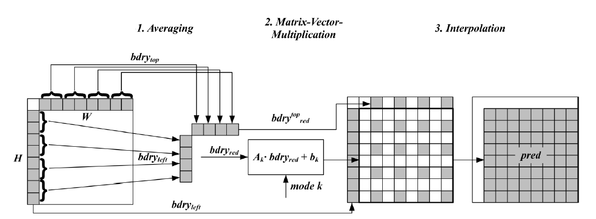

# Matrix weighted intra prediction


The generation of the prediction signal is based on the following three steps, which are **averaging**, matrix **vector multiplication** and **linear interpolation**.




#### General implementation

```c++
cu.mipFlag = true;
pu.multiRefIdx = 0;

double mipHadCost[MAX_NUM_MIP_MODE] = { MAX_DOUBLE };
initIntraPatternChType(cu, pu.Y());

initIntraMip( pu, pu.Y() );

const int transpOff    = getNumModesMip( pu.Y() );
const int numModesFull = (transpOff << 1);
for( uint32_t uiModeFull = 0; uiModeFull < numModesFull; uiModeFull++ )
{
    const bool     isTransposed = (uiModeFull >= transpOff ? true : false);
    const uint32_t uiMode       = (isTransposed ? uiModeFull - transpOff : uiModeFull);
    
    pu.mipTransposedFlag = isTransposed;
    
    pu.intraDir[CHANNEL_TYPE_LUMA] = uiMode;
    predIntraMip(COMPONENT_Y, piPred, pu);
    
    // Use the min between SAD and HAD as the cost criterion
    // SAD is scaled by 2 to align with the scaling of HAD
    Distortion minSadHad = std::min(distParamSad.distFunc(distParamSad)*2, distParamHad.distFunc(distParamHad));
    
    m_CABACEstimator->getCtx() = SubCtx( Ctx::MipFlag, ctxStartMipFlag );
   
    uint64_t fracModeBits = xFracModeBitsIntra(pu, uiMode, CHANNEL_TYPE_LUMA);
    double cost = double(minSadHad) + double(fracModeBits) * sqrtLambdaForFirstPass;

    mipHadCost[uiModeFull] = cost;
    DTRACE(g_trace_ctx, D_INTRA_COST, "IntraMIP: %u, %llu, %f (%d)\n", minSadHad, fracModeBits, cost, uiModeFull);
    
    updateCandList( ModeInfo( true, isTransposed, 0, NOT_INTRA_SUBPARTITIONS, uiMode ), cost, uiRdModeList,  CandCostList, numModesForFullRD + 1 );
    updateCandList( ModeInfo( true, isTransposed, 0, NOT_INTRA_SUBPARTITIONS, uiMode ), 0.8*double(minSadHad), uiHadModeList, CandHadList,  numHadCand );
}
const double thresholdHadCost = 1.0 + 1.4 / sqrt((double)(pu.lwidth()*pu.lheight()));
reduceHadCandList(uiRdModeList, CandCostList, numModesForFullRD, thresholdHadCost, mipHadCost, pu, fastMip);
```


#### Averaging neighboring samples

Out of the boundary samples, four samples in the case of W=H=4 and eight samples in all other cases are extracted by averaging.

```c++
IntraPrediction::initIntraMip
		|
		V
MatrixIntraPrediction::prepareInputForPred

// Step 1: Save block size and calculate dependent values
initPredBlockParams(block);

// Step 2: Get the input data (left and top reference samples)
m_refSamplesTop.resize(block.width);
for (int x = 0; x < block.width; x++)
{
    m_refSamplesTop[x] = pSrc.at(x + 1, 0);
}

m_refSamplesLeft.resize(block.height);
for (int y = 0; y < block.height; y++)
{
    m_refSamplesLeft[y] = pSrc.at(y + 1, 1);
}

// Step 3: Compute the reduced boundary via Haar-downsampling (input for the prediction)
const int inputSize = 2 * m_reducedBdrySize;
m_reducedBoundary.resize( inputSize );
m_reducedBoundaryTransposed.resize( inputSize );

int* const topReduced = m_reducedBoundary.data();
boundaryDownsampling1D( topReduced, m_refSamplesTop.data(), block.width, m_reducedBdrySize );

int* const leftReduced = m_reducedBoundary.data() + m_reducedBdrySize;
boundaryDownsampling1D( leftReduced, m_refSamplesLeft.data(), block.height, m_reducedBdrySize );

int* const leftReducedTransposed = m_reducedBoundaryTransposed.data();
int* const topReducedTransposed  = m_reducedBoundaryTransposed.data() + m_reducedBdrySize;
for( int x = 0; x < m_reducedBdrySize; x++ )
{
    topReducedTransposed[x] = topReduced[x];
}
for( int y = 0; y < m_reducedBdrySize; y++ )
{
    leftReducedTransposed[y] = leftReduced[y];
}

// Step 4: Rebase the reduced boundary
m_inputOffset       = m_reducedBoundary[0];
m_inputOffsetTransp = m_reducedBoundaryTransposed[0];

const bool hasFirstCol = (m_sizeId < 2);
m_reducedBoundary[0] = hasFirstCol ? (m_inputOffset       - (1 << (bitDepth - 1))) : 0; // first column of matrix not needed for large blocks
m_reducedBoundaryTransposed[0] = hasFirstCol ? (m_inputOffsetTransp - (1 << (bitDepth - 1))) : 0;
for (int i = 1; i < inputSize; i++)
{
    m_reducedBoundary          [i] -= m_inputOffset;
    m_reducedBoundaryTransposed[i] -= m_inputOffsetTransp;
}
```


#### Matrix Multiplication

A matrix vector multiplication, followed by addition of an offset, is carried out with the averaged samples as an input. The result is a reduced prediction signal on a subsampled set of samples in the original block.

```c++
IntraPrediction::predIntraMip
		|
		V
MatrixIntraPrediction::predBlock
		|
    	V
MatrixIntraPrediction::computeReducedPred

const int inputSize = 2 * m_reducedBdrySize;

// use local buffer for transposed result
static_vector<int, MIP_MAX_REDUCED_OUTPUT_SAMPLES> resBufTransposed( m_reducedPredSize * m_reducedPredSize );
int*const resPtr = (transpose) ? resBufTransposed.data() : result;

int sum = 0;
for( int i = 0; i < inputSize; i++ ) { sum += input[i]; }
const int offset = (1 << (shiftMatrix - 1)) - offsetMatrix * sum;
    
const uint8_t *weight = matrix;
const int   inputOffset = transpose ? m_inputOffsetTransp : m_inputOffset;

const bool redSize = (m_sizeId == 2);
int posRes = 0;
for( int y = 0; y < m_reducedPredSize; y++ )
{
    for( int x = 0; x < m_reducedPredSize; x++ )
    {
        if( redSize ) weight -= 1;
        int tmp0 = redSize ? 0 : (input[0] * weight[0]);
        int tmp1 = input[1] * weight[1];
        int tmp2 = input[2] * weight[2];
        int tmp3 = input[3] * weight[3];
        for (int i = 4; i < inputSize; i += 4)
        {
            tmp0 += input[i]     * weight[i];
            tmp1 += input[i + 1] * weight[i + 1];
            tmp2 += input[i + 2] * weight[i + 2];
            tmp3 += input[i + 3] * weight[i + 3];
        }
        resPtr[posRes++] = ClipBD<int>( ((tmp0 + tmp1 + tmp2 + tmp3 + offset) >> shiftMatrix) + inputOffset, bitDepth );
        
        weight += inputSize;
    }
}
```


#### Interpolation

The prediction signal at the remaining positions is generated from the prediction signal on the subsampled set by linear interpolation which is a single step linear interpolation in each direction.

```c++
MatrixIntraPrediction::predictionUpsampling

const int* verSrc     = src;
SizeType   verSrcStep = m_blockSize.width;

if( m_upsmpFactorHor > 1 )
{
    int* const horDst = dst + (m_upsmpFactorVer - 1) * m_blockSize.width;
    verSrc = horDst;
    verSrcStep *= m_upsmpFactorVer;

    predictionUpsampling1D( horDst, src, m_refSamplesLeft.data(),
                            m_reducedPredSize, m_reducedPredSize,
                            1, m_reducedPredSize, 1, verSrcStep,
                            m_upsmpFactorVer, m_upsmpFactorHor );
}

if( m_upsmpFactorVer > 1 )
{
    predictionUpsampling1D( dst, verSrc, m_refSamplesTop.data(),
                            m_reducedPredSize, m_blockSize.width,
                            verSrcStep, 1, m_blockSize.width, 1,
                            1, m_upsmpFactorVer );
}
```

