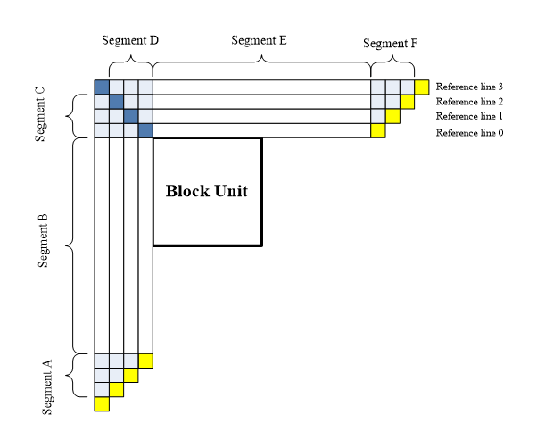

# Multiple reference line intra prediction


**Initialization**

The index of selected reference line (mrl_idx) is signalled. 

MRL is disabled for the first line of blocks inside a CTU to prevent using extended reference samples outside the current CTU line.

```c++
int numOfPassesExtendRef = (isFirstLineOfCtu ? 1 : MRL_NUM_REF_LINES);

pu.multiRefIdx = 1;

const int  numMPMs = NUM_MOST_PROBABLE_MODES;
unsigned  multiRefMPM [numMPMs];
PU::getIntraMPMs(pu, multiRefMPM);
```


**Model**

An example of 4 reference lines is depicted, where the samples of segments A and F are not fetched from reconstructed neighboring samples but padded with the closest samples from Segment B and E, respectively.   

HEVC: the nearest reference line (i.e., reference line 0). 

VTM: 2 additional lines (reference line 1 and reference line 3).




#### General Implementation

```c++
for (int mRefNum = 1; mRefNum < numOfPassesExtendRef; mRefNum++)
{   // reference line 1,3
    int multiRefIdx = MULTI_REF_LINE_IDX[mRefNum];
    pu.multiRefIdx = multiRefIdx;
    {
        initIntraPatternChType(cu, pu.Y(), true); // get reference samples
    }
    // for each extended reference line, 6 MPMs are checked
    for (int x = 1; x < numMPMs; x++)
    {
        uint32_t mode = multiRefMPM[x];
        {
            pu.intraDir[0] = mode;
            initPredIntraParams(pu, pu.Y(), sps);
            
            if (useDPCMForFirstPassIntraEstimation(pu, mode))
            {
                encPredIntraDPCM(COMPONENT_Y, piOrg, piPred, mode);
            }
            else
            {
                predIntraAng(COMPONENT_Y, piPred, pu);
            }
            
            // Use the min between SAD and SATD as the cost criterion
            // SAD is scaled by 2 to align with the scaling of HAD
            Distortion minSadHad = std::min(distParamSad.distFunc(distParamSad)*2, distParamHad.distFunc(distParamHad));
            
            // NB xFracModeBitsIntra will not affect the mode for chroma that may have already been pre-estimated.
            m_CABACEstimator->getCtx() = SubCtx( Ctx::MipFlag, ctxStartMipFlag );
            m_CABACEstimator->getCtx() = SubCtx( Ctx::ISPMode, ctxStartIspMode );
            m_CABACEstimator->getCtx() = SubCtx(Ctx::IntraLumaPlanarFlag, ctxStartPlanarFlag);
            m_CABACEstimator->getCtx() = SubCtx(Ctx::IntraLumaMpmFlag, ctxStartIntraMode);
            m_CABACEstimator->getCtx() = SubCtx( Ctx::MultiRefLineIdx, ctxStartMrlIdx );
            
            uint64_t fracModeBits = xFracModeBitsIntra(pu, mode, CHANNEL_TYPE_LUMA);
            
            double cost = (double)minSadHad + (double)fracModeBits * sqrtLambdaForFirstPass;
            
            updateCandList( ModeInfo( false, false, multiRefIdx, NOT_INTRA_SUBPARTITIONS, mode ), cost, uiRdModeList,  CandCostList, numModesForFullRD );
            updateCandList( ModeInfo( false, false, multiRefIdx, NOT_INTRA_SUBPARTITIONS, mode ), double(minSadHad), uiHadModeList, CandHadList,  numHadCand );
        }
    }
}
```


#### Get reference samples

```c++
IntraPrediction::initIntraPatternChType
		|
		V
IntraPrediction::xFillReferenceSamples
...
const int multiRefIdx = (area.compID == COMPONENT_Y) ? cu.firstPU->multiRefIdx : 0;
...
const int  predSize           = m_topRefLength;
const int  predHSize          = m_leftRefLength;
const int predStride = predSize + 1 + multiRefIdx;
...
const int  unitWidth          = tuWidth  <= 2 && cu.ispMode && isLuma(area.compID) ? tuWidth  : pcv.minCUWidth  >> (noShift ? 0 : getComponentScaleX(area.compID, sps.getChromaFormatIdc()));
const int  unitHeight         = tuHeight <= 2 && cu.ispMode && isLuma(area.compID) ? tuHeight : pcv.minCUHeight >> (noShift ? 0 : getComponentScaleY(area.compID, sps.getChromaFormatIdc()));

const int  totalAboveUnits    = (predSize + (unitWidth - 1)) / unitWidth;
const int  totalLeftUnits     = (predHSize + (unitHeight - 1)) / unitHeight;
const int  totalUnits         = totalAboveUnits + totalLeftUnits + 1; //+1 for top-left
const int  numAboveUnits      = std::max<int>( tuWidth / unitWidth, 1 );
const int  numLeftUnits       = std::max<int>( tuHeight / unitHeight, 1 );
const int  numAboveRightUnits = totalAboveUnits - numAboveUnits;
const int  numLeftBelowUnits  = totalLeftUnits - numLeftUnits;

// ----- Step 1: analyze neighborhood -----
const Position posLT          = area;
const Position posRT          = area.topRight();
const Position posLB          = area.bottomLeft();

bool  neighborFlags[4 * MAX_NUM_PART_IDXS_IN_CTU_WIDTH + 1];
int   numIntraNeighbor = 0;

memset( neighborFlags, 0, totalUnits );

neighborFlags[totalLeftUnits] = isAboveLeftAvailable( cu, chType, posLT );
numIntraNeighbor += neighborFlags[totalLeftUnits] ? 1 : 0;
numIntraNeighbor += isAboveAvailable     ( cu, chType, posLT, numAboveUnits, unitWidth,  (neighborFlags + totalLeftUnits + 1) );
numIntraNeighbor += isAboveRightAvailable( cu, chType, posRT, numAboveRightUnits, unitWidth,  (neighborFlags + totalLeftUnits + 1 + numAboveUnits) );
numIntraNeighbor += isLeftAvailable      ( cu, chType, posLT, numLeftUnits, unitHeight, (neighborFlags + totalLeftUnits - 1) );
numIntraNeighbor += isBelowLeftAvailable ( cu, chType, posLB, numLeftBelowUnits, unitHeight, (neighborFlags + totalLeftUnits - 1 - numLeftUnits) );

// ----- Step 2: fill reference samples (depending on neighborhood) -----

const Pel*  srcBuf    = recoBuf.buf;
const int   srcStride = recoBuf.stride;
      Pel*  ptrDst    = refBufUnfiltered;
const Pel*  ptrSrc;
const Pel   valueDC   = 1 << (sps.getBitDepth( chType ) - 1);

if( numIntraNeighbor == 0 )
{
    // Fill border with DC value
    for (int j = 0; j <= predSize + multiRefIdx; j++) { ptrDst[j] = valueDC; }
    for (int i = 0; i <= predHSize + multiRefIdx; i++)
    {
        ptrDst[i + predStride] = valueDC;
    }
}
else if( numIntraNeighbor == totalUnits )
{
    // Fill top-left border and top and top right with rec. samples
    ptrSrc = srcBuf - (1 + multiRefIdx) * srcStride - (1 + multiRefIdx);
    for (int j = 0; j <= predSize + multiRefIdx; j++) { ptrDst[j] = ptrSrc[j]; }
    for (int i = 0; i <= predHSize + multiRefIdx; i++)
    {
        ptrDst[i + predStride] = ptrSrc[i * srcStride];
    }
}
else // reference samples are partially available
{
    // Fill top-left sample(s) if available
    ...
    // Fill left & below-left samples if available (downwards)
    ...
    // Fill last below-left sample(s)
    ...
    // Fill above & above-right samples if available (left-to-right)
    ...
    // Fill last above-right sample(s)
    ...
    // pad from first available down to the last below-left
    ...
    // pad all other reference samples.
    ...
}
```


